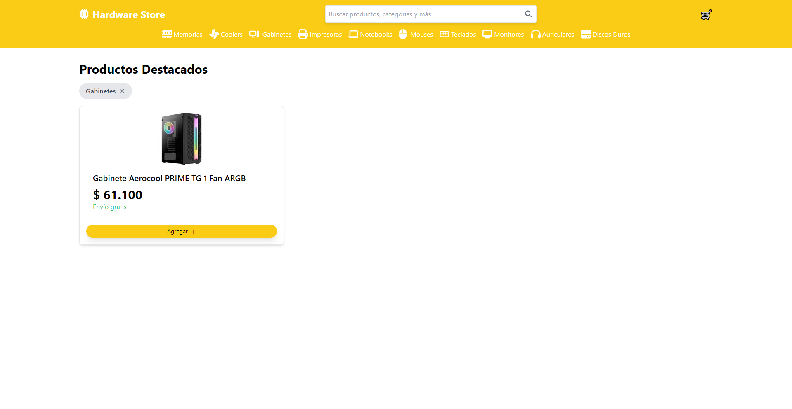
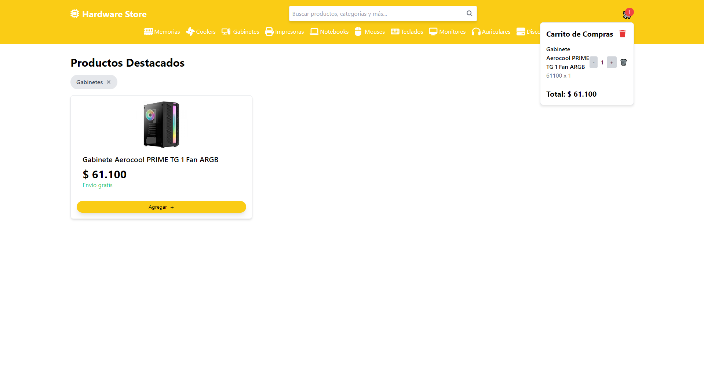

# 🛒 E-commerce Vue.js & Astro 🚀

[Español](README.md)  / [Inglés](README_EN.md) 

## 📖 Sobre el proyecto

Este proyecto es una **Tienda Online** donde puedes buscar productos, filtrarlos por categorías, agregar productos al carrito y proceder con la compra. La aplicación proporciona una experiencia de usuario fluida y eficiente, utilizando tecnologías modernas en el frontend. ¡Espero que disfrutes usando esta tienda tanto como yo disfruté creándola!

## 📋 Funcionalidades

- **Buscar Productos:** Los usuarios pueden buscar productos por nombre o categoría.
- **Filtrar Productos:** Los productos se pueden filtrar por categorías.
- **Agregar al Carrito:** Los usuarios pueden agregar productos al carrito de compras.
- **Visualización del Carrito:** Visualiza el contenido del carrito y la cantidad de productos.
- **Compra:** Procede con la compra de los productos seleccionados.

## 💻 Tecnologías usadas

- **Frontend:** Vue.js & Astro
- **Gestor de paquetes:** Yarn
- **Estilos:** Tailwind CSS

## 🚀 ¿Cómo deployarlo?

### Clonar el repositorio

1. Clona el repositorio desde GitHub: `git clone https://github.com/DarioAlbor/ecommerce-vue-astro.git`
2. Navega al directorio del proyecto: `cd ecommerce-vue-astro`

### Configurar y arrancar el cliente

3. Instala las dependencias: `yarn`
4. Inicia el cliente: `yarn serve`

¡Disfruta!

## 📬 Contacto

Puedes contactarme mediante mi [portafolio](https://darioalbor.dev.ar).

También puedes contribuir al proyecto sumando nuevas ideas o líneas de código. ¡Toda ayuda es bienvenida!

## 📸 Imágenes

|  |  |
|:---------------------------------:|:----------------------------------------:|
| Inicio                            | Filtrado                                |

|  |  |
|:---------------------------------------------------------:|:---------------------------------:|
| Busqueda del producto                                     | Carrito                           |