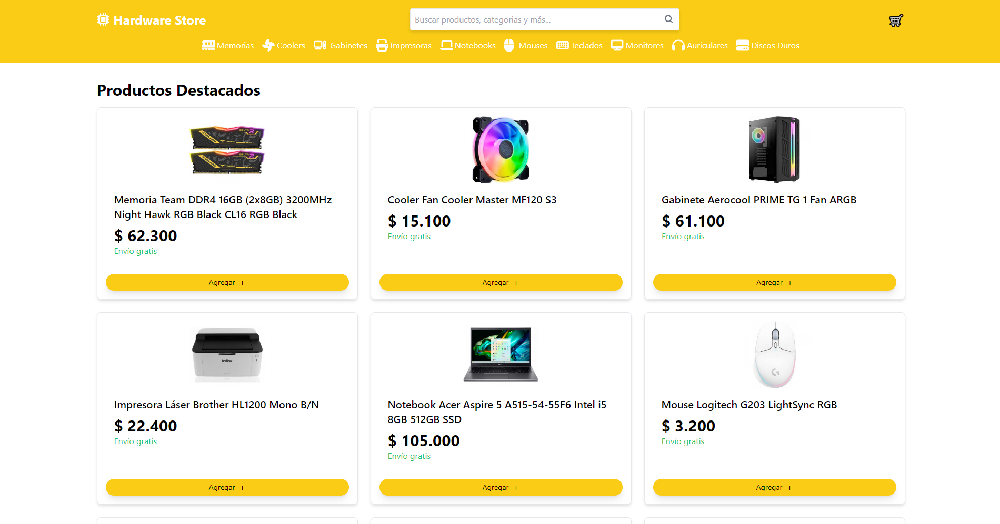
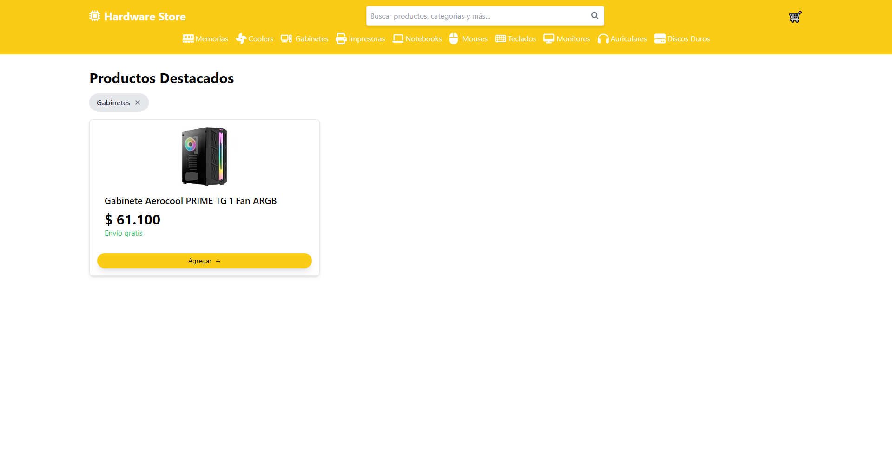
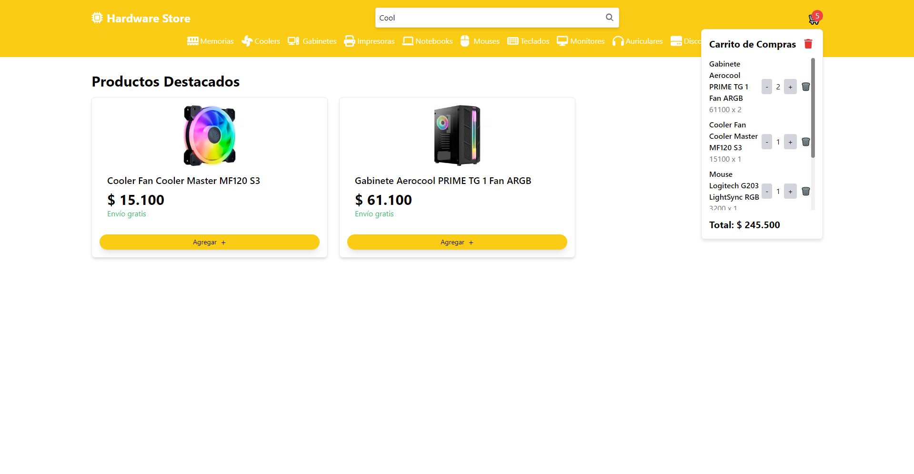
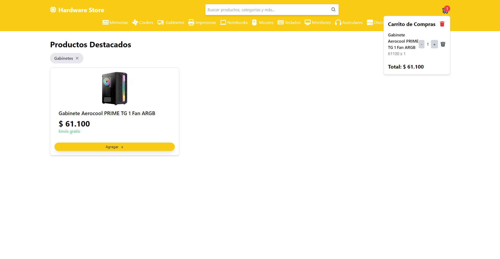

# 🛒 E-commerce Vue.js & Astro 🚀

[Español](README.md)  / [Inglés](README_EN.md) 

## 📖 About the project

This project is an **Online Store** where you can search for products, filter them by categories, add products to the cart, and proceed with the purchase. The application provides a smooth and efficient user experience using modern frontend technologies. I hope you enjoy using this store as much as I enjoyed creating it!

## 📋 Features

- **Search Products:** Users can search for products by name or category.
- **Filter Products:** Products can be filtered by categories.
- **Add to Cart:** Users can add products to the shopping cart.
- **Cart View:** View the contents of the cart and the quantity of products.
- **Checkout:** Proceed with the purchase of the selected products.

## 💻 Technologies Used

- **Frontend:** Vue.js & Astro
- **Package Manager:** Yarn
- **Styles:** Tailwind CSS

## 🚀 How to deploy it?

### Clone the repository

1. Clone the repository from GitHub: `git clone https://github.com/DarioAlbor/ecommerce-vue-astro.git`
2. Navigate to the project directory: `cd ecommerce-vue-astro`

### Configure and start the client

3. Install the dependencies: `yarn`
4. Start the client: `yarn serve`

Enjoy!

## 📬 Contact

You can contact me through my [portfolio](https://darioalbor.dev.ar).

You can also contribute to the project by adding new ideas or lines of code. Any help is welcome!

## 📸 Images

|  |  |
|:---------------------------------:|:---------------------------------:|
| Home                             | Filter                            |

|  |  |
|:--------------------------------------------------:|:-----------------------------:|
| Product Search                                      | Cart                          |